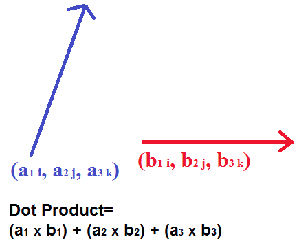

Path of Coding Challenges
================================================================================

## Coding Exercise 1

### dot product

Make a function that takes two vectors as input and outputs the dot product. Same thing as the sum of two vectors multiplied together.

### Super Hard Ruby and JavaScript Exam

| problem type | coding                                         
|--------------|--------------------------------------------------------
| name         | Dot Produt in Ruby
| statement    | calc dot product
| explanation  | calc dot product
| language     | Ruby
| start        | x = [1, 2, 3]\ny = [10, 10, 10]\ntotal = 0\n\n\ntotal
| solution     | 1.next.next
| output       | 60
| description  | calc dot product
